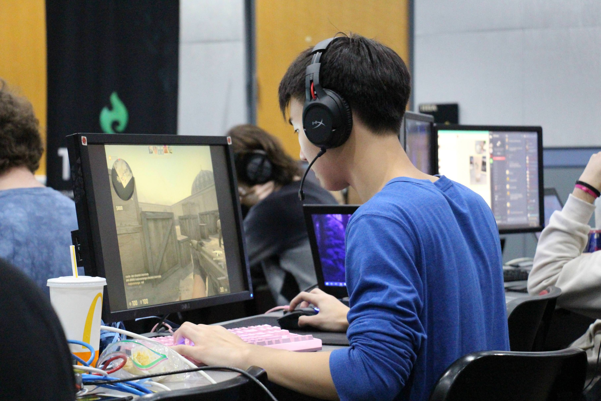

 <h1 style="font-family: Arial, Helvetica, sans-serif; color:rgb(226, 162, 43)"> <b> Current Obsession </b> </h1>
<iframe src="https://open.spotify.com/embed/track/6b6VqmlXXyuHqa27DGIHBe" width="100%" height="380" frameBorder="0" allowtransparency="true" allow="encrypted-media"></iframe>
<h1 style="font-family: Arial, Helvetica, sans-serif; color:rgb(226, 162, 43);font-size:120%"> <b onclick="appear()"> Check out my playlist (click me) </b> </h1>
<iframe src="https://open.spotify.com/embed/playlist/1LMHQSsiXkxztN9VXCarNF" width = "300px" height="580" frameBorder="0" allowtransparency="true" allow="encrypted-media" hidden id="appear"></iframe>

# About page

<t>
This page tells you a little about me. I played CS:GO competitively for the University of Maryland for four years and managed the community within the esports organization within the university. In addition to competing, I also enjoy videos games casually. I also enjoy playing and watching basketball, specifically the NBA. My newest hobby recently is chess! I think chess, basketball, and CS:GO all teach valuable tactical skills like strategy, positioning, and tactics.</t>
