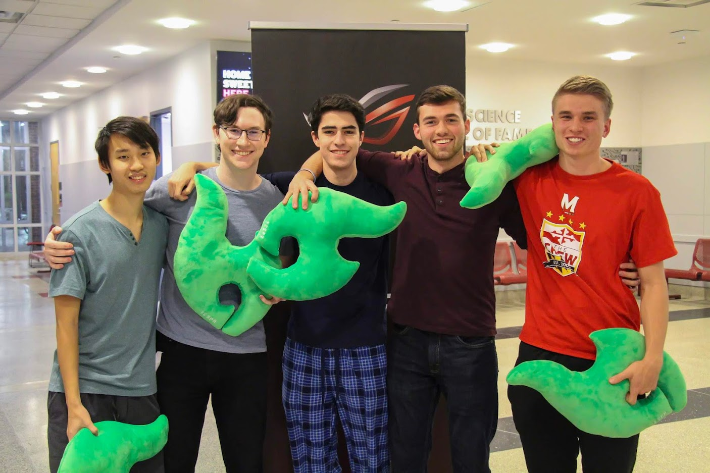
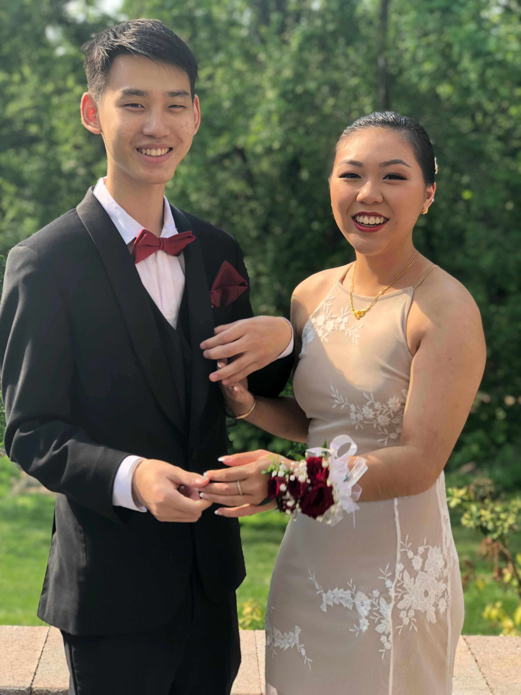
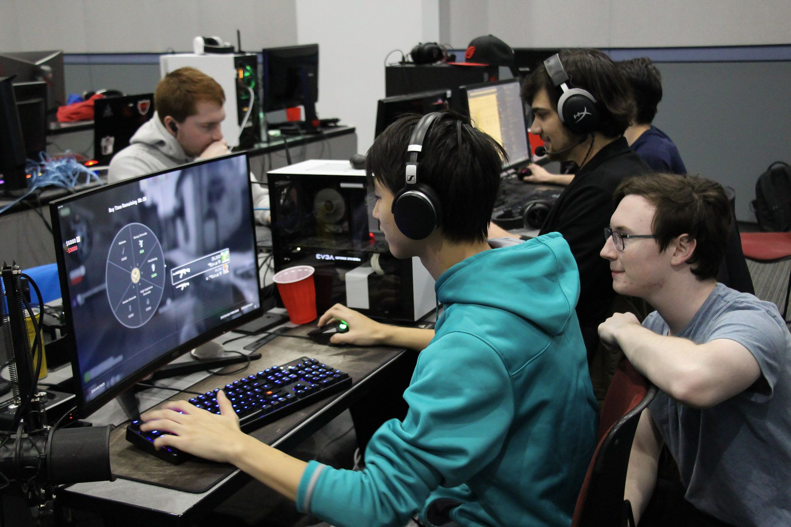

<button class = "butt" onclick="one()">1</button>
<button class = "butt" onclick="two()">2</button>
<button class = "butt" onclick="four()">4</button>

 

    

        
        
    

    

        
        
    

